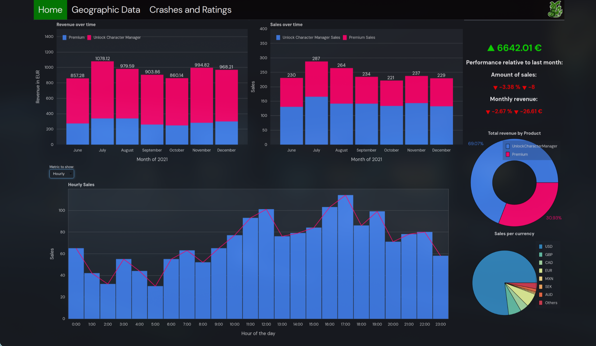
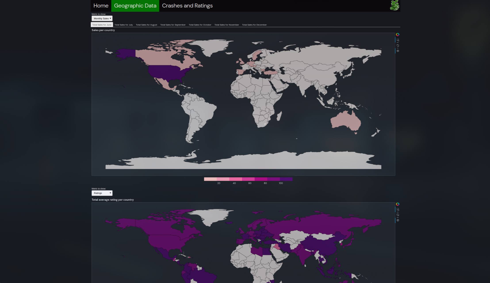
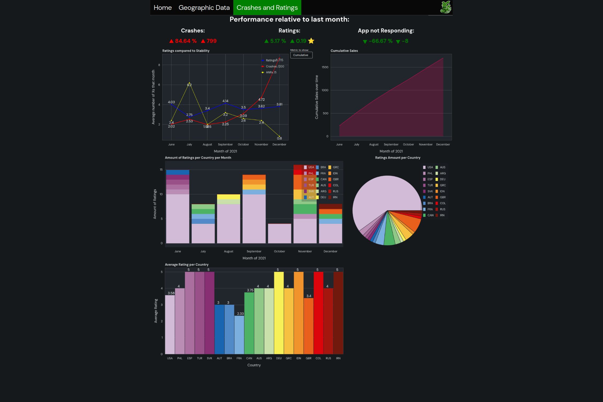
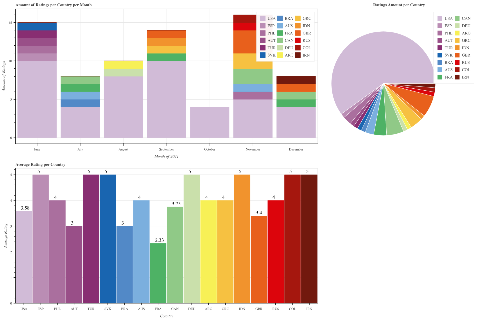

# visual_analytics_DnD5
First assignment for Data Science course at Leiden University 2025  
The goal of this assignment is to create a Dashboard with information on:
- The status and trends with respect to the monetization of the app
- The ratings and feedback given by users 
- The stability (crashes) of the app  

This information is provided based on the data from "Emerald-IT"'s Developer Console logs, which contains:  
- All purchases
- Ratings
- Feedback
- Crashes reported by the customers
# Usage
## Dependencies 
This python project makes use of a couple modules that are necesarry to generate the html:
```
pip install pandas, geopandas, bokeh, country-converter
```
## Generating the HTML file
If running from terminal make sure to be in `src` folder
```
python main.py
```

## Adding extra final styling
We could not figure out how to add link tags to the head of the generated HTML file so these need to be manually added above the style tags for the nice font:
```
    <link rel="preconnect" href="https://fonts.googleapis.com">
    <link rel="preconnect" href="https://fonts.gstatic.com" crossorigin>
    <link href="https://fonts.googleapis.com/css2?family=DM+Sans:ital,opsz,wght@0,9..40,100..1000;1,9..40,100..1000&display=swap" rel="stylesheet">
```
Bokeh also is a bit funky with how it handles divs so the navbar needs to be manually added to the top of the HTML body:
```
    <div class="topnav">
      <a class='active' href="https://liacs.leidenuniv.nl/~s3555380/main.html">Home</a>
      <a href="https://liacs.leidenuniv.nl/~s3555380/choropleths.html">Geographic Data</a>
      <a href="https://liacs.leidenuniv.nl/~s3555380/crashes.html">Crashes and Ratings</a>
      
    </div>
```
# Credits 
Geographic shapefile by [Natural Earth](https://www.naturalearthdata.com/downloads/110m-cultural-vectors/110m-admin-0-countries/)
# Screenshots of the final Website



# Extra Plots specifically for answering Assignment questions
To add more detail to one of the answers we are providing to a question of our assignment we threw together some extra graphs to make it easier on us to see the data and comment on it. These extra graphs can be generated by running the following in the src folder:  
```
python queries.py
```
This should generate the folowing graphs:  

As these were made last minute specifically to answer a question from our ansignment we did not add them to the dashboard on the website.
